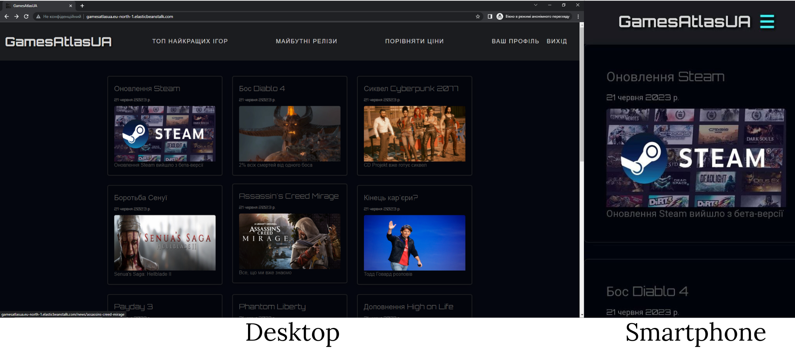
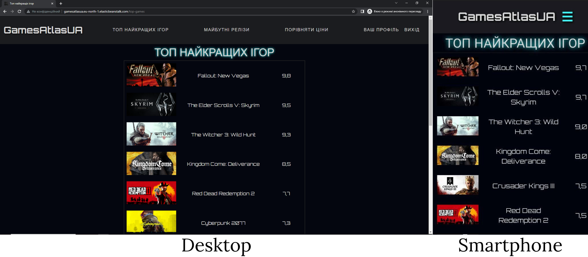
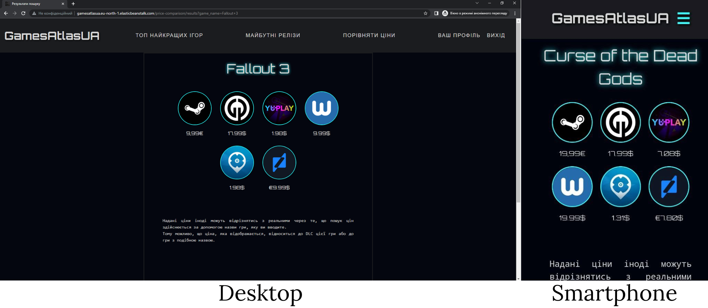
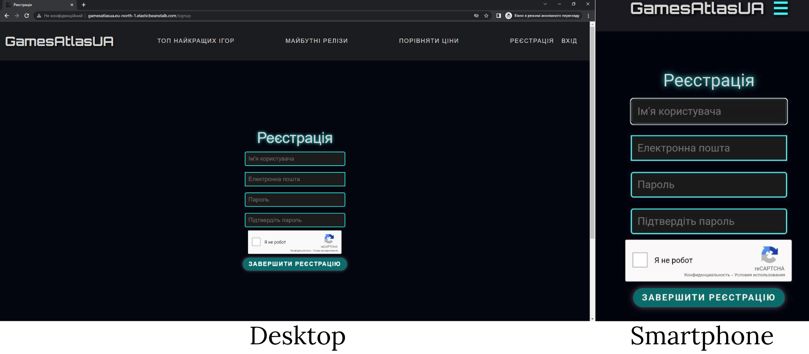
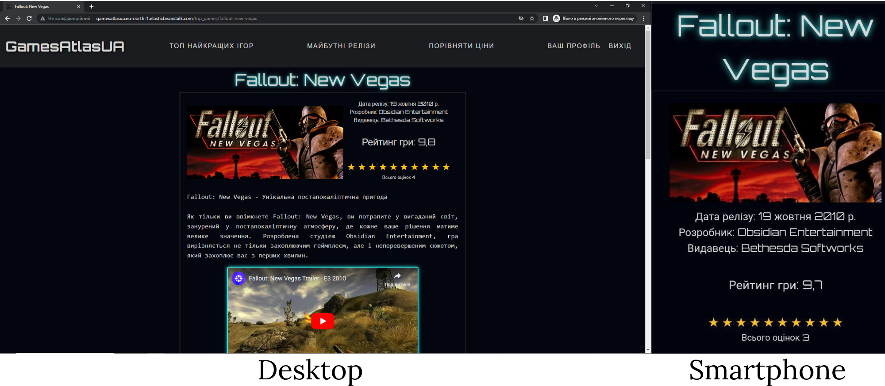

# DjangoProjectGamesAtlasUA

This is a game portal built using Django.

## Features

- **News:** View and comment on game news.
- **Top Games:** Check out the top-rated games and rate games yourself.
- **Upcoming Releases:** Stay updated on upcoming game releases and add them to your wishlist.
- **Game Price Comparison:** Get game prices from various stores by entering the game title.
- **User Registration and Login:** Register an account and receive a confirmation email for account verification.
- **User Profile:** View account information, game ratings, and wishlist.

## Installation

1. Clone the repository.
    ```shell
    git clone https://github.com/andwellbas/DjangoProjectGamesAtlasUA
    ```

2. Install the required dependencies listed in the `requirements.txt` file using pip.
    ```shell
    pip install -r requirements.txt
    ```

3. Configure the database settings in `settings.py`.

4. Set up the AWS S3 bucket and update the corresponding settings in `settings.py` for storing static files.

5. Update the necessary credentials in `views.py` for email notifications using SendGrid.

6. (Optional) Set up a virtual environment for the project.

## Usage

1. Run the Django development server locally.
    ```shell
    python manage.py runserver
    ```

2. Access the website at http://127.0.0.1:8000/.

## Contributing

Contributions to this project are welcome. If you have any bug reports, feature requests, or suggestions, please open an issue on the GitHub repository.

## Contact

For any inquiries or issues, please contact gamesatlasua@gmail.com.

## Deployment

This project is currently deployed on AWS Elastic Beanstalk. To deploy the project on a production server, follow these steps:

1. Set up your production environment with the necessary configurations, including the database, static file storage, and email service.

2. Update the relevant settings in `settings.py` for the production environment.

3. Deploy the project to the production server using your preferred deployment method.

## Screenshots




